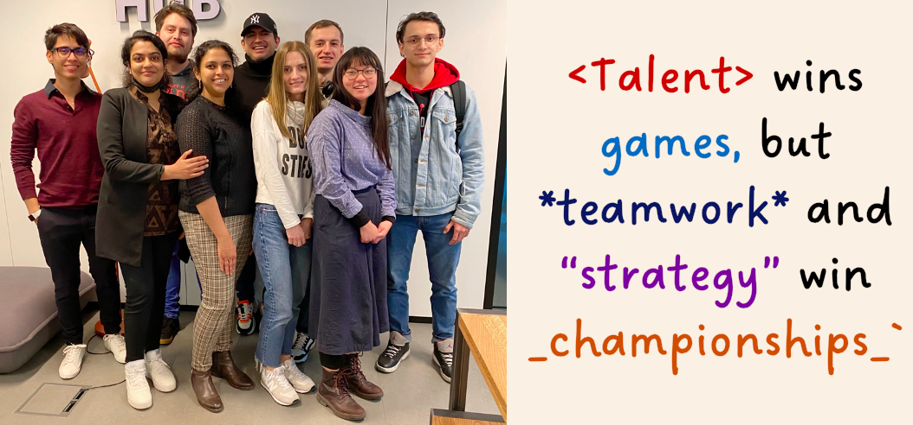
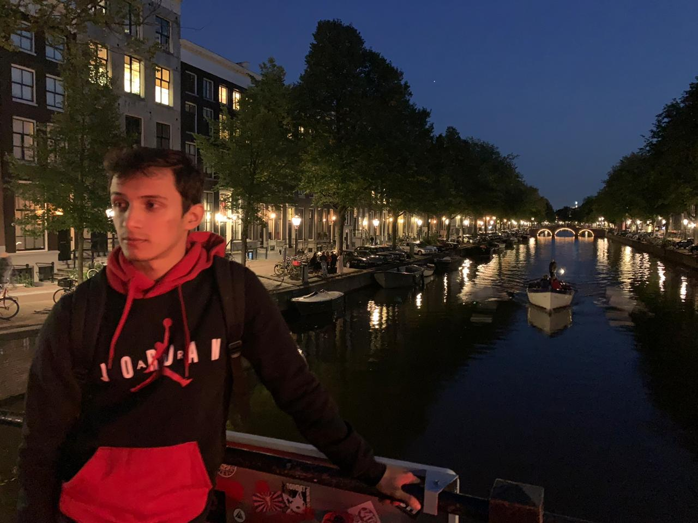

# Group 2

## **The members of Group 2 are**

- Ali 
- [@Andriivam](/people/andriivam.md) 
- [@Cristobal](/people/cristobal.md)
  
- Elias
- [@Hadoan](/people/hadoan.md) 
- [@Inna](/people/inna.md) 
- [@Minjupgeorge](/people/minjujoseph.md)
- [@RicardoPena](/people/ricardopena.md) 
- Swapna

|      Name      | Nationality | Place of stay |   Favorite Movie    | Favorite Hobby |
| :------------: | :---------: | :-----------: | :-----------------: | :------------: |
| Andrii Vlasiuk |  Ukrainian  |   Brusells    | Catch me if you can |    Fishing     |
|      Ali       |   Russian   |   Brusells    |       Amélie        |    Reading     |
|   Cristobal    | El Salvador |    Bruges     |       Avatar        |    Sporting    |
|     Elias      | Salvadorian |   Jodoigne    |       Knowing       |    Drawing     |
|     Hadoan     | Vietnamese  |    Leuven     |       Belfast       |    Singing     |
|      Inna      |  Ukrainian  |   Brussels    |   The green mile    |    Reading     |
|  MinjuPGeorge  |   Indian    |   Brussels    |       Fashion       |   Gardening    |
|  RicardoPena   | El Salvador |    Antwerp    |     The pianist     |    Cooking     |
|     Swapna     |   Indian    |   Brussels    |        Home         |   Travelling   |

<!-- describe your project -->

## Getting Started

<!-- a guide to using this repository -->

1. `git clone git@github.com:HackYourFutureBelgium/<project-name>.git`
2. `cd project-name`
3. `npm install`

## Code Quality Checks

- `npm run format`: Makes sure all the code in this repository is well-formatted
  (looks good).
- `npm run lint:ls`: Will lint the folder and file names in this repository to
  make sure they match the repo conventions.
- `npm run lint:md`: Will lint all of the Markdown files in this repository and
  let you know if there are any style mistakes to fix.
- `npm run spell-check`: Goes through all the files in this repository looking
  for words it doesn't recognize. Just because it says something is a mistake
  doesn't mean it is! It doesn't know every word in the world. You can add new
  correct words to the [./.cspell.json](./.cspell.json) file so they won't cause
  an error.

## Continuous Integration (CI)

When you open a PR to `main`/`master` in your repository, GitHub will
automatically do a linting check on the code in this repository, you can see
this in the[./.github/workflows/lint.yml](./.github/workflows/lint.yml) file.

If the linting fails, you will not be able to merge the PR. You can double check
that your code will pass before pushing by running `npm run lint:md` locally.

## Repo Setup

- Give each member _write_ access to the repo (if it's a group project)
- Turn on GitHub Pages and put a link to your website in the repo's description
- Turn on GitHub Actions
- in the _Branches_ section of your repo's settings make sure:
  - The repository
    [requires a review](https://github.blog/2018-03-23-require-multiple-reviewers/)
    before pull requests can be merged.
  - The `master`/`main` branch must "_Require status checks to pass before
    merging_"
  - The `master`/`main` branch must "_Require require branches to be up to date
    before merging_"
